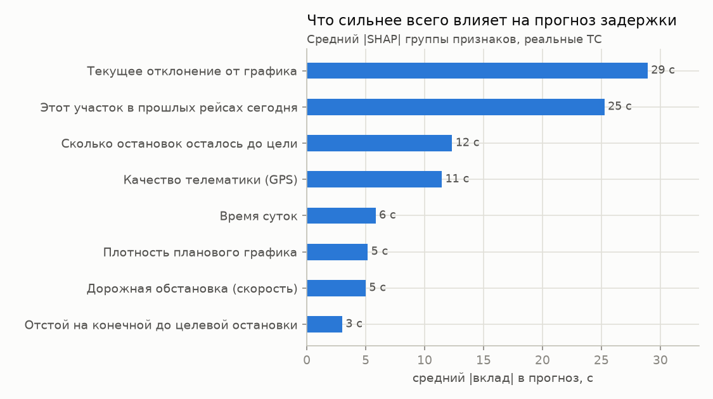
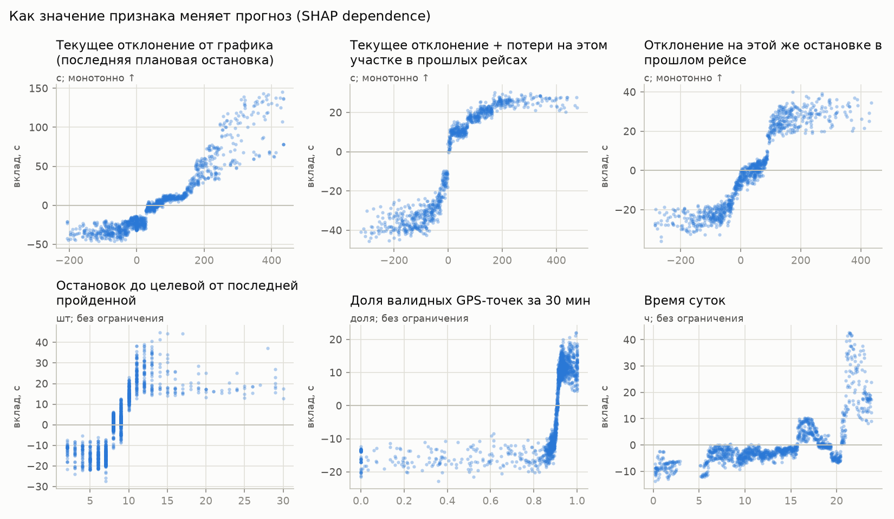
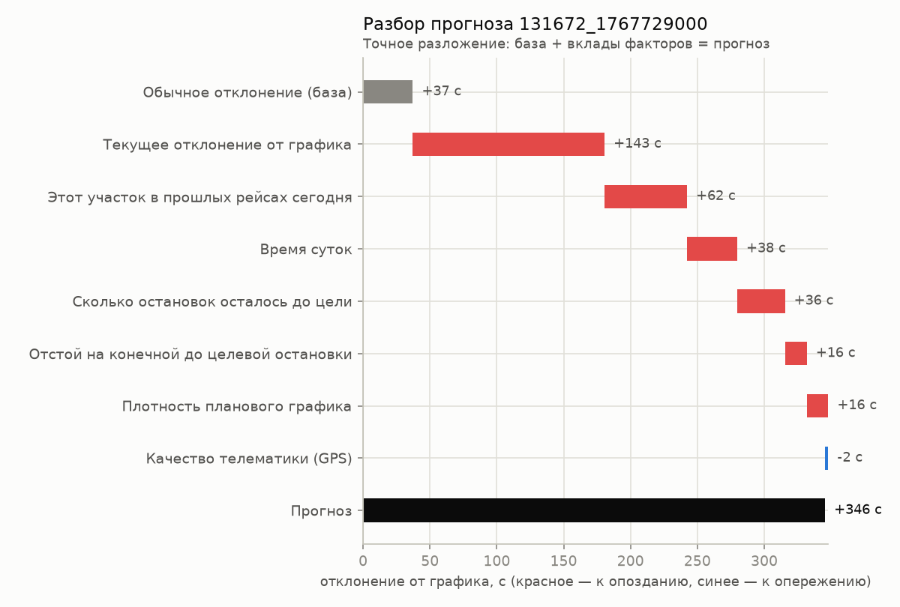
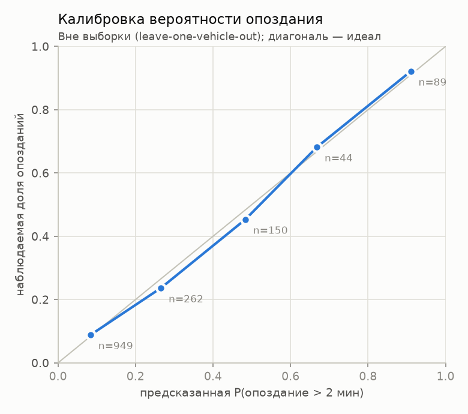

# Карточка модели: прогноз отклонения от графика на 10–15 мин

## Назначение

Для каждого ТС в момент `T` прогнозируется отклонение от графика (сек, `+` опоздание,
`−` опережение) на первой остановке с плановым прибытием в окне **(T+10, T+15] мин**.
Прогноз, его неопределённость и причина показываются диспетчеру в карточке инцидента.

## Модель

| | |
|---|---|
| Тип | **один** LightGBM (регрессия, Huber δ=60 с), 7 листьев × 300 деревьев |
| Признаков | **9**, все физически интерпретируемы (таблица ниже) |
| Ограничения | строгая монотонность по 4 признакам (0 нарушений на 7 200 проверках) |
| Правило | цель — первая остановка рейса → прогноз × 0.15 (ТС выпускают по расписанию) |
| Неопределённость | P(опоздание > 2 мин), 80%-интервал, ожидаемая ошибка — из распределения out-of-fold остатков |
| Объяснение | TreeSHAP одной модели, **точное**: база + вклады = прогноз (ошибка < 1e-12 с) |
| Артефакты | `artifacts/compact/model.txt` (текстовый LightGBM), `meta.json` (признаки, группы, калибровка) |

### Признаки

| Признак | Смысл | Монотонность |
|---|---|---|
| `cur_dev_s` | текущее отклонение (последняя плановая остановка) | ↑ |
| `det_plus_hist_gain` | отклонение по GPS + сколько ТС теряло на этом участке в прошлых рейсах сегодня | ↑ |
| `hist_tgt_delay` | отклонение на этой же остановке в прошлом рейсе | ↑ |
| `det_stops_to_tgt` | остановок до целевой от последней пройденной по GPS | — |
| `plan_path_speed` | плановая скорость на участке до цели (плотность графика) | — |
| `layover_slack_s` | запас времени на отстое на конечной (нет отстоя → пусто) | ↓ |
| `speed_mean_5m` | средняя скорость за 5 мин | — |
| `valid_share_30m` | доля валидных GPS-точек за 30 мин | — |
| `hour` | время суток | — |

Все признаки считаются **только по данным ≤ T** (тест `tests/test_no_leak.py`: признаки,
посчитанные офлайн, совпадают с онлайн-контекстом, где данных после `T` физически нет).

## Качество (leave-one-vehicle-out, только реальные ТС)

Реальное ТС и его синтетические копии всегда в одном фолде: модель проверяется на ТС,
которого не видела.

| Сегмент | n | ноль | `cur_dev_s` | модель |
|---|---|---|---|---|
| все реальные | 1494 | 93.0 | 88.4 | **68.1** |
| только test | 353 | 103.3 | 93.4 | **74.1** |
| без отстоя на пути | 1033 | 99.1 | 73.4 | 67.7 |
| с отстоем на пути | 461 | 79.3 | 121.9 | 69.1 |
| цель = старт рейса | 153 | 65.2 | 124.1 | 64.5 |
| GPS деградирован | 129 | 43.1 | 50.3 | 44.9 |

MAE, секунды. Лидерборд: ансамбль v3 — **1.00000** (в зачёте), компактная модель — **0.81415**.

Почему на validate ансамбль лучше, а в честной CV — нет: в train лежат синтетические копии
реальных ТС на весь день, включая периоды validate. Модели на 86 признаках находят «копию» и
считывают её ответ. Эксперимент на test (обучение на train с копиями и без):

| MAE на test, с | компактная (9) | LightGBM (86) | CatBoost (86) |
|---|---|---|---|
| train без синтетики (честно) | 73.0 | 72.4 | 72.9 |
| train с копиями периода проверки | 68.7 | 58.8 | 55.8 |

Без копий модели равны; выигрыш ансамбля на лидерборде — запоминание копий, а не
обобщение. Для новых дней (где копий нет) компактная модель не хуже, поэтому она продовая.

Сравнение с исследовательским ансамблем (LightGBM×5 + CatBoost×2 + GRU×3, 86 признаков):
MAE 68.05 / 75.5 — то же качество при 10 моделях и 86 признаках. Выбрана простая модель.

## Честная оценка: три протокола

Синтетические ТС в train — копии реальных на весь день, поэтому «train → test» и лидерборд
завышают качество моделей, умеющих узнавать копии. Решения принимались только по чистым
протоколам (`ml/protocol.py`):

| MAE, с | P1: новый маршрут (leave-one-vehicle-out) | P3: новое время (учимся на прошлом → проверка на будущем) |
|---|---|---|
| бейзлайн `cur_dev_s` | 88.4 | 83.8 |
| LightGBM, 86 признаков | 69.2 | 68.2 |
| **компактная, 9 признаков** | **68.2** | **65.7** |

Проверены и отклонены (не лучше шума или хуже в одном из протоколов): метка «ручного»
факта, доля детекций GPS, свежесть GPS-задержки, старт рейса как признак, задержка по
положению, маршрутные признаки (горизонт, число остановок, позиция в рейсе, расстояние),
L1 без монотонности, усиление регуляризации, Huber δ=30/120, онлайн-поправка на недавние ошибки.

**Политика обучения финальной модели**: реальные ТС + синтетика, из которой исключены копии
периодов validate (±30 мин, 750 строк) — модель не видит ответов даже через копии.

## Объяснимость — проверено, а не заявлено

`python -m ml.explain_eval` → `reports/explainability.json`, графики в `reports/figures/`.

| Проверка | Результат |
|---|---|
| Точность разложения (база + вклады = прогноз) | ошибка 5e-13 с |
| Монотонность по 4 признакам | 0 нарушений из 7 200 |
| Верность (deletion test): «выключить» главную группу vs случайную | прогноз меняется на 38 с против 10 с |
| Устойчивость у соседних точек (5 мин) | косинус векторов вкладов 0.83 |
| Калибровка P(опоздание) вне выборки | Brier 0.117 против 0.171 у константы; кривая у диагонали |
| 80%-интервал вне выборки | накрывает 78.6% фактов |
| Ожидаемая ошибка vs фактическая | 68.4 с vs 68.1 с |

Главные факторы (средний |вклад|): текущее отклонение 30 с, история участка 23 с,
остановок до цели 14 с, качество GPS 14 с, время суток 5 с, скорость 5 с,
плотность графика 5 с, отстой 4 с.

Пример текста для карточки инцидента (генерируется автоматически):

> Прогноз: опоздание +2:01 (80%-интервал +0:07…+4:56, P(опоздание > 2 мин) = 50%).
> Обычно: +0:41; вклад факторов: этот участок в прошлых рейсах сегодня +0:33;
> сколько остановок осталось до цели +0:18; дорожная обстановка (скорость) +0:11.

## Скорость (CPU, 1 поток)

| Шаг | p50 |
|---|---|
| признаки точки | 0.66 мс |
| модель | 0.023 мс |
| TreeSHAP | 0.12 мс |
| онлайн-прогноз точки целиком (признаки + модель + калибровка + объяснение) | **1.1 мс** |
| цикл по всему парку (10 ТС) | **21 мс** |

Ансамбль для сравнения: 10.5 мс на точку, 55 мс на парк.

## Масштабируемость и надёжность

Дообучение (full / warm, гейт champion/challenger, реестр версий, горячая перезагрузка),
шардирование инференса и деградация при обрыве связи — в [`SCALING.md`](SCALING.md).

## Ограничения

- Данные — один день и 13 реальных маршрутов; сезонность и дни недели не видны.
- Около 15% фактов в эталоне заполнены вручную (0 или копия); модель узнаёт этот режим
  только косвенно, по деградации GPS.
- Целевые остановки — старт рейса: факт там почти шум, работает правило «× 0.15».
- Переобучение на новых днях: `python -m ml.compact --cv --fit`.
